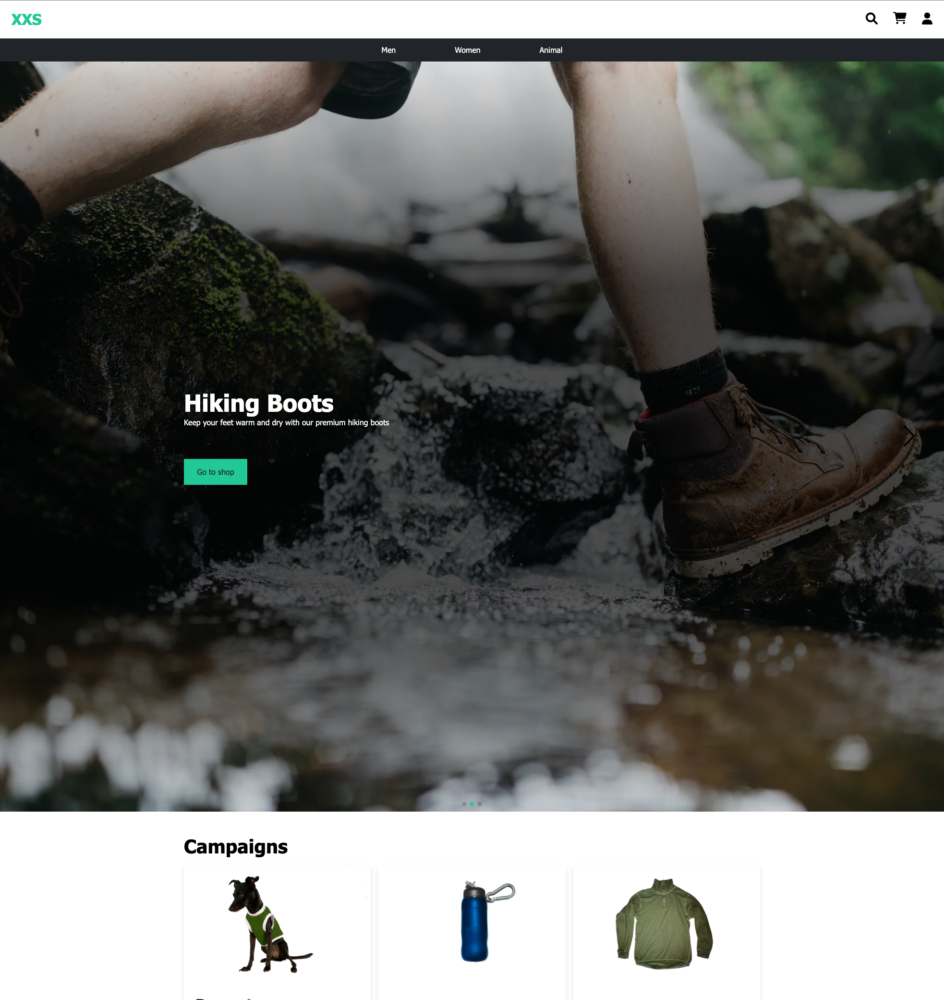

<!-- Tamplate from https://github.com/othneildrew/Best-README-Template -->

<!-- PROJECT LOGO -->
 

  

  <h3 align="center">XXS Hiking Equipment</h3>

  

    A project to learn frontend & backend development in our bachelor course!
     
     
    <a href="http://gr02.appdev.cloudns.ph/">View Demo</a>
    ·
    <a href="https://github.com/jKm00/hiking-equipment/issues">Report Bug</a>
    ·
    <a href="https://github.com/jKm00/hiking-equipment/issues">Request Feature</a>
  

<!-- TABLE OF CONTENTS -->

  
Table of Contents

  <ol>
    <li>
      <a href="#about-the-project">About The Project</a>
      <ul>
        <li><a href="#built-with">Built With</a></li>
      </ul>
    </li>
    <li>
      <a href="#getting-started">Getting Started</a>
      <ul>
        <li><a href="#development"backend>Development</a>
            <ul>
                <li><a href="#backend---dev">Backend - Dev</a></li>
                <li><a href="#frontend---dev">frontend - Dev</a></li>
            </ul>
        </li>
        <li><a href="#production"backend>Production</a>
          <ul>
            <li><a href="backend---prod">Backend - Prod</a>
              <ul>
                <li><a href="intellij-setup">IntelliJ SetUp</a></li>
                <li><a href="running-the-backend">Running the Backend</a></li>
              </ul>
            </li>
            <li><a href="frontend---prod">Frontend - Prod</a></li>
          </ul>
        </li>
      </ul>
    </li>
    <li><a href="#license">License</a></li>
    <li><a href="#contact">Contact</a></li>
    <li><a href="#acknowledgments">Acknowledgments</a></li>
    <li><a href="#postman-tests">Postman tests</a></li>
  </ol>

<!-- ABOUT THE PROJECT -->

## About The Project

A project to learn both frontend and backend development. This project is used in our batchelor program for learning purposes only.

Our webpage is designed for a fictional company (XXS) with the main purpose of selling premium hiking equipment. For now you can add items to cart and place an order, but the order will never get processed.

(<a href="#top">back to top</a>)

### Built With

The frameworks and tools used in this project:

- [React.js](https://reactjs.org/)
- [Spring Boot](https://spring.io/)
- [PostgreSQL](https://www.postgresql.org/)
- [Docker](https://www.docker.com/)

(<a href="#top">back to top</a>)

<!-- GETTING STARTED -->

## Getting Started

### Development

#### Backend - Dev

1. Open the backend in your IDE of choice
2. Run the backend through your IDE

*The backend will boot up an in memory database which is only populated with an admin user*

#### Frontend - Dev

1. Open webapp in your IDE of choice (/frontend/webapp)
2. Create an `.env` file in the root folder of the frontend
3. Add environment variable: `REACT_APP_API_BASE_URL=http://localhost:8080/api`
4. Run `npm install` to install all dependencies
5. Run `npm start` to start the react app

### Production

#### Backend - Prod

##### IntelliJ SetUp

1. Create an `.env` file in the root folder of the backend (/backend)
2. Add environment variabler:
   - `POSTGRES_USERNAME`
   - `POSTGRES_PASSWORD`
   - `DATABASE_NAME`
   - `POSTGRES_PORT`
   - `JWT_KEY`
3. Download and install ".env file support" plugin for intellij. (Make sure it's working, might need to restart idea)
4. Enable "EnvFile" in "Run/Debug Configurations" and select the `.env` file created in step 1

##### Running the Backend

1. Package the project with `mvn package`
3. Run `docker-compose up --build -d` in terminal.

#### Frontend - Prod

1. Open webapp in your IDE of choice (/frontend/webapp)
2. Create an `.env` file in the root folder of the frontend
3. Add environment variable: `REACT_APP_API_BASE_URL=http://localhost:80/api`
4. Run `npm install` to install all dependencies
5. Run `npm start` to start the react app

(<a href="#top">back to top</a>)

<!-- LICENSE -->

## License

Distributed under NTNU. Only for learning purposes

(<a href="#top">back to top</a>)

<!-- CONTACT -->

## Contact

Eduard Andrei Cristea - eduardac@ntnu.no  
Richileu Alphonso Bailey - richileb@ntnu.no  
Torstein Eide - torstei@ntnu.no  
Joakim Edvardsen - joakied@ntnu.no

(<a href="#top">back to top</a>)

<!-- ACKNOWLEDGMENTS -->

## Acknowledgments

- [Readme Template](https://github.com/othneildrew/Best-README-Template#getting-started)
- [Swiper JS](https://swiperjs.com/react)

(<a href="#top">back to top</a>)

## Postman tests

https://www.getpostman.com/collections/1591bbc3e3de4d28a527
